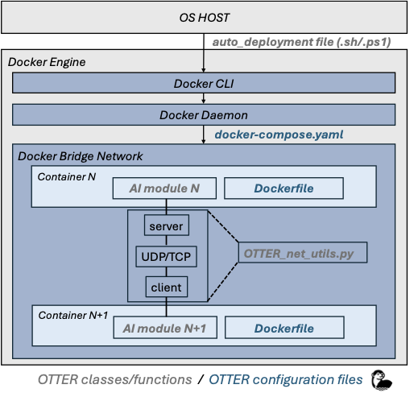
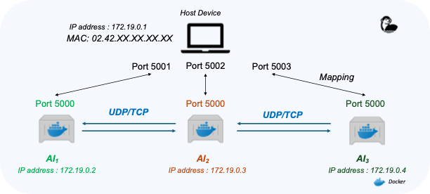
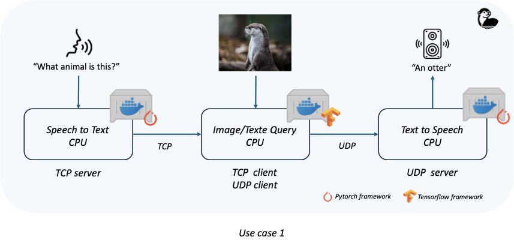
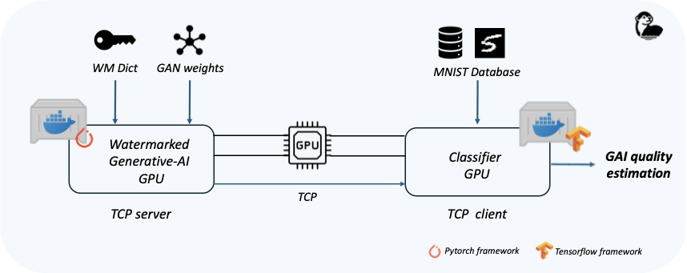

# OTTER: Operational Toolkit for AI deploymenT and Execution using dockeR

*Author: **Zoughebi Mateo***

*Contact: mateo.zoughebi@telecom-sudparis.eu*

*The following abstract is extracted from the associated paper; for more details, please refer to the original publication. Additionally, this **README** is intended to assist users in deploying the pipeline and does not cover all aspects of the software.*

---

## Abstract :

> While the need for complex, abstract tasks to be collaboratively handled by distributed, heterogeneous AI is steadily growing in any type of computing environment, it becomes particularly challenging at the edge, where computing, storage, and connectivity resources are both scarce and time-variant. **OTTER** provides an end-to-end software suite for the AI dynamic deployment and resource control in a containerized, multi-host emulated edge network. Specifically, OTTER caters for the needs of various AI solutions, irrespective of their development choice (TensorFlow or PyTorch), hardware deployment (CPU or GPU) and connectivity needs (TCP or UDP). The code is provided in Python and considers Docker (both Linux and Windows distributions) as containerization solution. Its genericity is illustrated through two use cases related to multimedia processing by AI, namely Multimodal Query-Answering and trustworthy generative AI in 6G. The former demonstrates the OTTER capability to handle multi-framework and muti-connectivity set-ups while the latter demonstrates the effectiveness of dynamic resource (GPU) sharing among multi-framework AIs.
> 

---

## OTTER Features :

- Virtualization of an **Edge Network** (TestBed)
- AIs deploy in containers using **Docker**
- **Communication** between Containers (TCP/UDP)

---

## Dependencies :

- Windows or Linux
    
      — Tested on Windows 11 and Ubuntu22.04
    
- Docker

---

## Summary :

**1.**      Deploy a single Hello World container with OTTER
**1.Bis.**  Deploy a single container of an AI technology based on part 1 (from Hugging face)
**2.**      Deploy multiple independent containers in an Edge Network (TCP)
**3.**      Use Case 1: Deployment of an AI multi-modal and multi-framework pipeline 
**4.**      Use Case 2 : Deploy two AI models concurrently on the same GPU using two different frameworks (TensorFlow and PyTorch).

---

## *Disclaimer :*

*During this step by step tutorial, Linux users need to run the .sh script and Windows
users the associated .ps1 script.* 

*Except for 1. and 1.bis, the detailed Docker commands can be found in auto_deployment.sh, but they are abstracted in docker-compose.yaml*

*For each section, when a Docker container executes code, its output is redirected to the log file in the corresponding folder*

*During the next steps, an error indicating that containers with the specified names are already
assigned may appear, specially when you move to another pipeline deployment (ex: from part 2 to part 3). To clean images and containers, run the scripts in the folder: Managing_images_containers.*

---

## OTTER architecture


---

## 1.  Deploy a single Hello World container with OTTER

This part provide a way to deploy a Docker Hello World container. The associate code is provided in ***single_container*** folder. 

### Architecture of the folder :

```markdown

SINGLE_CONTAINER/
├── inputs                  # Folder that contains the inputs used in the AI code provided in (module_ai.py)
├── logs                    # Folder to save container logs which are the ouputs of your different functions
├── Dockerfile.base         # Dockerfile for building the AI module container
├── module_ai.py            # Python code of the AI module which contains the main section and future (TCP connection)  
├── requirements.txt        # Requirements file for building the environment used by the module
├── start.sh                # Script containing the commands executed when the container is launched: main of module_ai.py
```

### Commands for a manual deployment of an Hello_world_python_container :

```bash
cd single_container
docker build -f Dockerfile.base -t image_module_ai .
docker run -d --name module_1_container  -v .:/app/  image_module_ai
```

*Check the correct execution in the log file : `INFO - Hello world from the container`*

*NOTE : The build command needs to be executed only if the Docker image image_module_ai is not found (the first time).*

---

## 1.Bis Deploy an AI Hugging Face Module in the previous architecture

This section is a use case application of the previous one. It explains how to deploy a Hugging Face module using the same architecture.

### Modification steps

- Updating the ***Dockerfile***: The current Hugging Face pipeline requires ffmpeg to function :
`RUN apt-get update && apt-get install -y ffmpeg && apt-get cleand`
- Updating the ***Requirement.txt*** : It is possible to generate it from a local environment with the following command:  `pip freeze > requirements.txt`
- Updating the ***module_ai.py*** :
- Import specific libraries
- Initialize the device
- In the placeholder for AI classes, include the Hugging Face pipeline: a class composed of process and run functions 
- In the AI inference placeholder, use instance of this class
- The inference output can be logged or saved as a .txt file in the current folder :

`INFO -  AI prediction : Recognized Text =  What animal is it?`

*NOTE :* 

The final code is provided in ***single_container_use_case***. Follow these instructions and adapt them for your custom AI class.

### Manual Deployment of an AI module container :

```bash
cd single_container_use_case
docker build -f Dockerfile.base -t image_module_ai .
docker run -d --name module_1_container  -v .:/app/  image_module_ai
```

---

## 2.  Deploy multiple independent containers and establish TCP connections in a bridged virtual network.

**Each container hosts an AI module, similar to the previous section.**

- **Dockerfile.base**: Defines a shared environment for all containers to optimize memory.
- **Dockerfile.module_n**: Adds module-specific dependencies.

**Communication** is managed by the OTTER class (*otter_net_utils.py*), supporting:

- **TCP & UDP** for NumPy arrays and strings (UDP: strings only).
- **Python sockets** for client-server interactions (e.g., *module_1* (server), *module_2* (client), *module_3* (server)).




### Architecture of the folder :

```markdown
multi_containers_TCP/
├── modules/                         # Folder that contains all AI modules
│   ├── module_1/                    # First AI module (similar to the SINGLE_CONTAINER architecture)
│   │   ├── inputs/                  # Folder that contains the inputs used in the AI code provided in module_1.py
│   │   ├── logs/                    # Folder to save container logs
│   │   ├── Dockerfile.module_1      # Dockerfile for building the AI module 1 container
│   │   ├── module_1.py              # Python code of the AI module containing the main section and connexion part
│   │   └── start.sh                 # Script containing commands executed when container 1 is launched (module_1.py)
│   ├── module_2/                    # Second AI module
│   │   ...
│   ├── module_3/                    # Third AI module
│   │   ...
│   ├── docker-compose.yaml          # File for automating the deployment of the pipeline (Network + Containers)
│   └── otter_net_utils.py           # Python class for TCP or UDP interactions
├── auto_deployment.sh               # Bash script to automatically deploy and build the associated container
├── auto_deployment.ps1              # Associated file for windows users
├── Dockerfile.base                  # Dockerfile for building the base image (common to all modules)
└── requirements.txt                 # Requirements file for building the environment used by the modules
```

*NOTE : Docker compose is a parametrable yaml file which allows docker to deploy containers
For each container, it is required to indicate a docker service which contains basic docker informations for deployment such as :
Context of execution, Image Name, Container Name, Linked Volumes and Networks parameters.*

### Automatic Deployment

```bash
## For automatic windows deployment (with --build option
cd multi_containers_TCP
./auto_deployment.ps1
```

```bash
## For automatic linux deployment (with --build option)
cd multi_containers_TCP
bash auto_deployment.sh 
```

*Check the correct execution in each  log files* 

---

## 3.  Use Case 1 : Virtual deployment of multimodal query/answering AI pipeline

The next section provides an example of a possible use case for the previous pipeline.

Four Hugging Face AI models run in a bridged network across three modules:

1. **Speech-to-Text** (TCP server) converts speech to text.
2. **Image Analysis** (TCP/UDP client) extracts context from an image and sends a text response.
3. **Text-to-Speech** (UDP server) converts the response to speech and saves it.

The code which implements the pipeline is provide in useCase_1.



### Automatic Deployment

```bash
## For automatic windows deployment (with --build option)
cd useCase_1
./auto_deployment.ps1
```

```bash
## For automatic linux deployment (with --build option)
cd useCase_1
bash auto_deployment.sh 
```

*Check the correct execution in each log files for example `OTTER` in log file in module_3*

---

## 5.  USE CASE 2 : Virtual deployment of multimodal query/answering AI pipeline

**Use Case 2:** Deploy two AI models (PyTorch & TensorFlow) in parallel on the same GPU.

1. **GAN Inference** (PyTorch, TCP server): Uses a watermarked GAN to generate MNIST samples and verify authenticity.
2. **Classifier** (TensorFlow, TCP client): Trains in parallel on the same GPU and evaluates GAN-generated samples.

*NOTE:  Each framework requires a specific Docker image:*

- ***Dockerfile.base** builds the PyTorch module.*
- ***Dockerfile.module1** builds the TensorFlow module.*

***Deployment:** Docker Compose runs both modules with GPU specs. Module_2.py trains PyTorch while waiting for accuracy results from Module_1.py (TensorFlow). A Python thread ensures parallel training before waiting for GAN inference.*

The code which implements the pipeline is provide in useCase_2.



Automatic Deployment 

```bash
## For automatic windows deployment (with --build option) 
cd useCase_2
./auto_deployment.ps1
```

```bash
## For automatic linux deployment (with --build option)
cd useCase_2
bash auto_deployment.sh
```

*Check the correct execution in each log files for example `INFO - GAN quality : 0.9287640452384949` in log file n°2 (this value might vary a little).* 

#######
END
#######